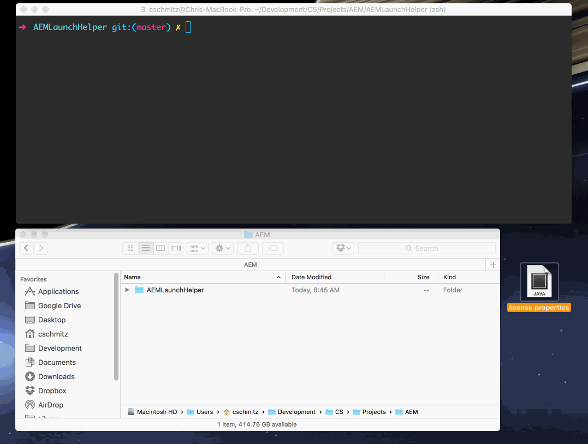

# AEM Helper

**Project still in progress**

## Purpose

AEM Launch Helper is a command line utility that facilitates the launching of an AEM instance.

Note that the environment folders and files that are created by this application will be placed in the same directory that you place the project folder. I.e. If you place this project folder at:

    ~/Development/AEMLaunchHelper

The environment folders will be created next to it:

    ~Development:
        AEMLaunchHelper/
        AEMEnvironments/...

## Installation

### Adding the jar file

The AEM environment jar file isn't actually included in the project. If you're using this tool you should already have that file.

The jar file should be placed in the `assets/` folder at the root of this project and renamed to the following:

    aem-environment-port.jar

### Creating `config.js` file

come back and fill this in

### Add the `aemhelper` command to your path

To get access to the `aemhelper` command, you just need to run the `npm link` command.

    cd AEMLaunchHelper
    npm link
    
    aemhelper --help

## Tasks

### Create a new server environment

Creates a new environment for an AEM instance. Note that this _does not_ start the instance.

    aemhelper create --environment <env> --port <port> --license <license>

- type (dev, author, QA, testing, production)
- port
- license (relative or absolute path to license file)

### Start AEM instance

Starts the AEM environment instance per the given environment string.

    aemhelper start -e <environment>

    - environment (author, publish)

### Stop AEM instance

Stops the AEM environment instance per the given environment string.

    aemhelper  stop -e <environment>

### Restart AEM instance

Stops and Starts the AEM environment instance per the given environment string.

    aemhelper  stop -e <environment>

### Slay AEM instance

Stops the AEM instance and deletes the crx-quickstart directory.

**NOTE that this will destroy your instance's data so be sure to back up first**

    aemhelper slay -e <environment>

### Push to AEM instance

Takes your local File Vault file system and pushes it into your AEM instance.

    aemhelper push

### Watch your local files to sync with AEM instance

Watches your local File Vault file system for changes and pushes those changes into your AEM instance on change.

    aemhelper watch

## Not sure if we can do this but maybe!

### AEM Status

check system to see if the specific aem instance is running or not (px aux | grep ...)?
